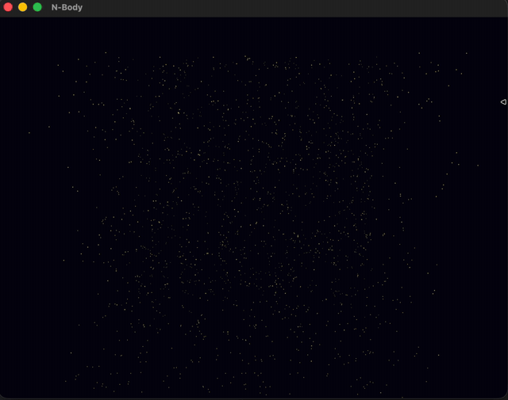
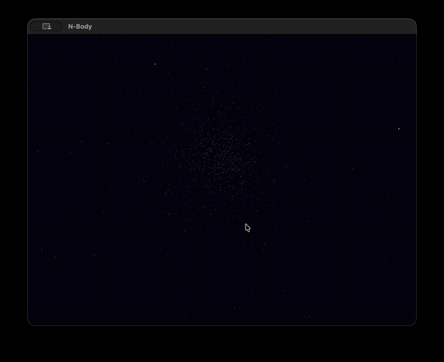

# N-Body Particle Renderer

Real-time 3D gravitational N-body simulation rendered with OpenGL 3.3 core.
2000 particles attract each other under Newtonian gravity (O(n²) direct
method, softened, semi-implicit Euler integration) and are drawn as glowing
points colored by speed — cold blue when slow, hot yellow when fast.

Built as a C++ learning project: the physics core, window/GL plumbing, and
render pipeline are hand-written with no engine.

| Initial collapse | Steady state |
|---|---|
|  |  |

## Controls

| Input | Action |
|---|---|
| Left-drag | orbit the camera around the cloud |
| Scroll | zoom in/out |

## Build & run

Requires CMake ≥ 3.23, a C++17 compiler, and [GLFW](https://www.glfw.org/) +
[glm](https://github.com/g-truc/glm) (e.g. `brew install glfw glm`). The
[glad](https://gen.glad.sh/) GL loader is vendored in `third_party/`.

```sh
cmake -B build
cmake --build build
./build/MyProgram
```

## Architecture

```
src/
  common/    Particle struct + physics constants (shared data contract)
  physics/   nbody.cpp — O(n²) forces, symplectic Euler step, energy check
  renderer/  Window (GLFW+GL context), Shader (GLSL compile/link),
             Camera (orbit, view/projection), ParticleRenderer (VAO/VBO upload+draw)
  app/       main.cpp — ties input → physics step → upload → draw
shaders/     particle.vert / particle.frag (GLSL 330 core)
```

Correctness of the physics core is verified by energy conservation: with the
softened potential matching the softened force, total energy drifts ~0.03%
over 1000 steps (`total_energy()` in `src/physics/nbody.cpp`).

## Roadmap

- [ ] GNU Octave reference implementation + cross-language verification
      (shared LCG seed, identical initial conditions)
- [ ] SIMD-optimized force kernel (NEON on ARM64, AVX2 on x86-64) with a
      benchmark table: Octave → C++ scalar → C++ SIMD
